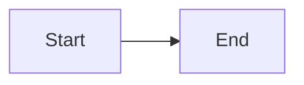

# Welcome to [Slidev](https://github.com/slidevjs/slidev)!

Nyx Foundation プレゼンテーションテンプレート

## Quick Start

```bash
bun install
bun dev
```

visit <http://localhost:3030>

## スライド作成方法

### 基本

1. **slides.md** を編集してスライドを作成
2. `---` で各スライドを区切る
3. 保存すると自動でリロードされる

### 画像の使用

画像は `public/images/` に格納:

```
public/
└── images/
    ├── logo.png
    └── screenshot.jpg
```

スライド内での参照:

```md

```

### レイアウト

```yaml
---
layout: cover      # カバーページ
---

---
layout: two-cols   # 2カラム
---

左側のコンテンツ

::right::

右側のコンテンツ
```

### Mermaid図

````md

````

### 数式 (KaTeX)

```md
インライン: $E = mc^2$

ブロック:
$$
\sum_{i=1}^{n} x_i
$$
```

### スタイリング (UnoCSS)

```html
<div class="grid grid-cols-2 gap-4">
  <div class="bg-blue-50 p-4 rounded">左</div>
  <div class="bg-green-50 p-4 rounded">右</div>
</div>
```

### PDF出力

```bash
bun run export
```

## ファイル構成

```
├── slides.md          # メインスライド
├── public/
│   └── images/        # 画像ファイル
├── components/        # カスタムVueコンポーネント
└── styles/            # カスタムCSS
```

## Documentation

- [Slidev 公式ドキュメント (日本語)](https://ja.sli.dev/)
- [Slidev Documentation (English)](https://sli.dev/)
