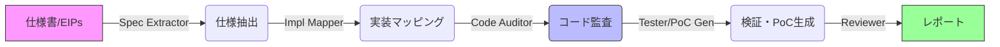

# イーサリアムクライアント実装における 自動脆弱性検知

## Automatic Vulnerability Detection in Ethereum Client Implementation

  
堤 真聖 (Nyx Foundation)

  
SCIS2026

<!--
Nyx Foundationの堤です。
本日は「イーサリアムクライアント実装における自動脆弱性検知」というタイトルで発表させていただきます。
本研究は、大規模言語モデルを用いたAIエージェントを用いて、イーサリアムのクライアント実装に対するセキュリティ監査を自動化・効率化する試みです。
実際に開催された監査コンテストでの評価結果も交えて報告します。
-->

---
layout: two-cols
layoutClass: gap-8
---

# 背景: イーサリアムのクライアント多様性

イーサリアムは**単一の参照実装を持たず**、共通仕様に基づく複数の独立したクライアント実装が連携して稼働する(Client Diversity)。

- **実行層 (EL)**: Geth, Nethermind, Besu, Erigon, Reth 等
- **合意形成層 (CL)**: Lighthouse, Nimbus, Teku, Prysm, Lodestar 等
- **$N \times M$ の組み合わせ**による相互運用

::right::

  
メリット: 耐障害性 (Resilience)

  
特定の実装にバグがあってもネットワーク全体は停止しない（単一障害点の排除）。

  
課題: 検証コストの増大

  

    <ul>
      <li>実装間の微細な解釈違いが致命的な <strong>コンセンサス障害 (Chain Split)</strong> を招く</li>
      <li>全組み合わせの網羅的な検証はコストが指数関数的に増大</li>
    </ul>
  

<!--
まず背景です。
イーサリアムの大きな特徴として「クライアント多様性 (Client Diversity)」が挙げられます。
ビットコインなどとは異なり、単一の参照実装が存在せず、仕様書に基づいて開発された複数の独立したクライアントソフトが並存しています。
左側に示したように、実行層・合意形成層それぞれに多数の実装があり、これらがN対Mで相互運用しています。

右側をご覧ください。この多様性は、特定のソフトにバグがあってもネットワーク全体が止まらないという強力な耐障害性を生みます。
一方で、セキュリティ監査の観点からは非常にコストが高い構造です。
わずかな仕様の解釈違いがチェーンの分岐（スプリット）などの致命的な障害につながるため、アップグレードのたびに全ての組み合わせを検証する必要があるからです。
-->

---

# 既存手法の限界

プロトコルアップグレードごとの検証には、従来以下の手法が用いられてきたが、それぞれに限界がある。

  
① 人手による監査

  <ul class="text-sm list-disc pl-4 space-y-1">
    <li>専門家によるコードレビュー</li>
    <li><strong>スケーラビリティに欠ける</strong></li>
    <li>コストが高い</li>
  </ul>

  
② 差分ファジング (Fluffy, Forky等)

  <ul class="text-sm list-disc pl-4 space-y-1">
    <li>同一入力を複数クライアント与えて比較</li>
    <li><strong>意味論的盲点 (Semantic Blindness)</strong> 全員が同じ勘違いをしていると検知できない</li>
    <li>Deep Stateへの到達が困難</li>
  </ul>

  LLMエージェントを用いて「熟練監査員のワークフロー」を自動化できないか？

<!--
これまでの検証手法には限界がありました。
一つは「専門家によるマニュアル監査」ですが、これは当然スケーラビリティに欠け、コストも莫大です。
もう一つは「差分ファジング」です。同じ入力を各クライアントに食わせて出力を比較する手法ですが、これには「意味論的盲点」という弱点があります。
つまり、仕様自体が曖昧で全員が同じように間違った実装をしていた場合、差分が出ず検知できないのです。

そこで本研究では、LLMエージェントを用いることで、仕様を理解し、熟練監査員のような手順でコードを検証するプロセスを自動化できないかと考えました。
-->

---

# 提案手法: AI監査エージェント

監査プロセス（仕様理解、コード探索、検証、報告）を一気通貫で行う**Human-in-the-Loop (HITL) エージェント**を構築。

- **コンテキストエンジニアリング**: 
  - プロジェクト全体ではなく、「仕様ID」に関連する関数のみを抽出してLLMに入力 (Scope Reduction)
  - 状態をJSONで管理し、各工程を独立したタスクとして実行

<!--
提案するAI監査エージェントの概要です。
このエージェントは、図のように「仕様の抽出」「実装箇所へのマッピング」「コード監査」「検証」「レポート作成」というパイプラインを実行します。
これは従来のFuzzingのようなブラックボックスな手法ではなく、ホワイトボックスな監査プロセスそのものを模倣する設計です。

技術的な工夫として「コンテキストエンジニアリング」を行っています。
数百万行あるコードを全てLLMに読ませるのではなく、特定の仕様IDに関連する関数のみを抽出して渡すことで、探索範囲を適切に絞り込んでいます。
また、完全に自律させるのではなく、最終確認や重要な判断に人間が介在するHuman-in-the-Loop構成を採用しています。
-->

---

# 3つの脆弱性検知戦略

熟練監査員の思考プロセスを模倣する3つの戦略を並行して実行。

  
(i) 仕様ベース静的検査

  

    抽出された仕様要件（例：定数値、境界条件）が実装で守られているかをチェック。「中立な監査員」ロール。
  

  
(ii) 類似バグ探索

  
★ 最も有効

  

    過去の脆弱性パターン（CVE等）をFew-shotとして与え、類似構造を探索。「既知バグの変種」を効率的に発見。
  

  
(iii) 動的テスト生成

  

    静的解析で疑わしい箇所に対して、単体テストや簡易Fuzzerを生成・実行。「テストエンジニア」ロール。
  

<!--
エージェントは主に3つの戦略で脆弱性を探索します。

1つ目は「仕様ベース静的検査」です。仕様書にある定数や条件がコード上で守られているかを確認します。
2つ目は「類似バグ探索」です。過去の脆弱性事例を知識として与え、似たようなコードパターンや論理構造がないかを探させます。結論から言うとこれが最も効果的でした。
3つ目は「動的テスト生成」です。怪しい箇所に対してピンポイントでテストコードやFuzzerを書いて検証します。
-->

---

# 評価実験: Fusaka監査コンテスト

**実験設定**:
- **対象**: イーサリアム次期アップグレード「Fusaka」(PeerDAS等を含む)
- **期間**: 2025年9月〜10月
- **対象**: 11種類の主要クライアント (Geth, Nethermind, Lighthouse, Nimbus等)
- **参加者**: スキルレベルの異なる4名が本エージェントを使用

<table class="w-full text-sm">
  <thead class="bg-gray-100">
    <tr>
      <th class="p-2">ID</th>
      <th class="p-2">バックグラウンド</th>
      <th class="p-2">主な役割・戦略</th>
    </tr>
  </thead>
  <tbody>
    <tr>
      <td class="p-2 border-b">参加者A</td>
      <td class="p-2 border-b">エンジニア経験あり</td>
      <td class="p-2 border-b">網羅的なコード探索</td>
    </tr>
    <tr>
      <td class="p-2 border-b">参加者B</td>
      <td class="p-2 border-b">ホワイトハッカー経験あり</td>
      <td class="p-2 border-b">PoC作成・詳細検証</td>
    </tr>
    <tr>
      <td class="p-2 border-b">参加者C</td>
      <td class="p-2 border-b">エンジニア経験限定的</td>
      <td class="p-2 border-b">ツール運用のみ</td>
    </tr>
    <tr class="bg-yellow-50">
      <td class="p-2 border-b font-bold">参加者D</td>
      <td class="p-2 border-b font-bold">未経験 (Non-expert)</td>
      <td class="p-2 border-b font-bold">類似探索の完全自動運転</td>
    </tr>
  </tbody>
</table>

<!--
評価のために、実際に開催された「Fusaka監査コンテスト」に参加しました。
これは次期アップグレードを対象とした大規模なバグバウンティです。
今回は、同じエージェントシステムを使いつつ、スキルレベルの異なる4名の参加者が運用を行いました。
特に注目していただきたいのが「参加者D」で、エンジニアリングやハッキングの経験がない非専門家（Non-expert）です。
-->

---
layout: two-cols
layoutClass: gap-8
---

# 検知結果: コンテスト1位

  17件 の有効な脆弱性を報告

- 総提出数: 54件 (Valid率 31.5%)
- **報告件数において第1位**の成果
- 特にNimbus, Grandine等のCLクライアントで多数発見（PeerDASの新規実装部分）

"従来のFuzzingでは到達困難な『仕様の解釈違い』に起因する論理バグを多数検出できた"

::right::

戦略別の有効性

| 戦略 | Valid | Total | Rate |
|---|---|---|---|
| **類似バグ探索** | **14** | 34 | **41.2%** |
| コード解析 | 2 | 18 | 11.1% |
| Fuzzing | 1 | 2 | 50.0% |

参加者別の成果

| 参加者 | Status | Valid |
|---|---|---|
| **D** | **Non-expert** | **9 (Top)** |
| B | Hacker | 7 |
| A | Engineer | 1 |

<!--
結果です。
エージェントチーム全体で54件を報告し、そのうち17件が有効（Valid）と認定され、コンテスト全体で報告件数1位となりました。
特に、PeerDASという新機能を実装したCLクライアントで多くのバグを発見しました。

右側の表をご覧ください。戦略別では「類似バグ探索」が14件と圧倒的でした。
また、参加者別では、なんと未経験者の「参加者D」が9件のバグを見つけトップの成績でした。
これは、適切なツールがあれば専門知識がなくても監査に貢献できることを示しています。
-->

---

# 考察: なぜ有効だったのか？

## 1. 類似バグ探索 (Semantic Search) の優位性
- 未知の脆弱性の多くは、**「過去のバグの構造的変種」**であった。
- LLMは意味論的（Semantic）な類似性を理解できるため、変数名が違っても「同じロジックミス」を検知できた。
- *例: 境界値処理のミス、ロックの取得漏れ*

## 2. 監査の民主化 (Democratization)
- エンジニア経験のない**参加者Dが最も高い成果（9件）**を上げた。
- 適切なツールと「既知のパターン」があれば、専門家でなくとも高度な監査が可能。
- セキュリティ人材不足への有力な解。

<!--
なぜこれほど成果が出たのか考察します。
第一に、「類似バグ探索」の優位性です。
未知のバグといっても、実は過去のバグの「変種」であることが多いです。
LLMは「変数名は違うがロジックは同じ」といった意味的な類似性を理解できるため、従来のツールでは見つけにくい論理バグを効率的に発見できました。

第二に、「監査の民主化」です。
ドメイン知識がない参加者Dが活躍できた事実は、AIエージェントが専門知識を補完し、セキュリティ監査への参入障壁を劇的に下げられる可能性を示唆しています。
これは業界全体の慢性的な人材不足に対する希望と言えます。
-->

---

# 誤検知 (False Positive) の要因

Valid率 31.5% ということは、約7割は棄却されている。主な要因は：

1. **脅威モデルの誤認**
   - 「信頼されているコンポーネント (Trusted EL)」からの入力を疑ってしまった。
   - 前提知識をプロンプトで厳格に定義する必要がある。

2. **テストコード/非稼働コードへの指摘**
   - ビルド対象外のモックなどを誤って監査対象に含んでしまった。
   - マッピングモジュールの精度向上が必要。

3. **仕様上の許容挙動**
   - クライアント独自の最適化や設計判断をバグと誤認。

<!--
もちろん課題もあります。Valid率は約3割で、残りは誤検知でした。
主な要因は「脅威モデルの誤認」です。コンテストのルールでは「実行層は信頼できる」という前提があったのに、そこからの入力を疑ってしまったりしました。
また、テストコードや使われていないコードを誤って監査してしまったケースもありました。
これらはプロンプトでより厳密に前提条件を与えることで改善できると考えています。
-->

---

# 今後の展望: チェックリスト駆動型へ

完全自律エージェントから、**「チェックリスト駆動型」**ワークフローへの進化が鍵。

1. **仕様定義**: 自然言語仕様と構造化データ
2. **トラストモデル**: 前提条件の明確化
3. **プロパティ抽出**: 「守るべき性質」と「やってはいけない事 (Anti-Property)」
4. **チェックリスト生成**: 仕様から具体的なコード確認項目へ変換
5. **検証**: LLMによるパターンマッチングと論理検証

  
Conclusion

  

    LLMエージェントは、現代の複雑な分散システムの監査において強力な武器となる。 特に「過去の知見」を再利用する<strong>Semantic Search</strong>と、<strong>HITL</strong>による検証プロセスの統合が有効である。
  

<!--
今後の展望です。
誤検知を減らし、より深い論理バグを見つけるために、「チェックリスト駆動型」への進化を進めています。
仕様書から「守るべき性質」をリスト化し、それを一つずつコードに照らし合わせて確認していくアプローチです。

まとめです。
LLMエージェントは、現代の複雑なシステムの監査において強力な武器になります。
特に「過去の知見の再利用」と「人間の判断を組み合わせたプロセス」が有効であることが今回の実験で示されました。
以上で発表を終わります。
-->

---
layout: cover
---

# Thank you!

ご清聴ありがとうございました。

  This work was supported by Nyx Foundation.

<!--
ご清聴ありがとうございました。
-->
