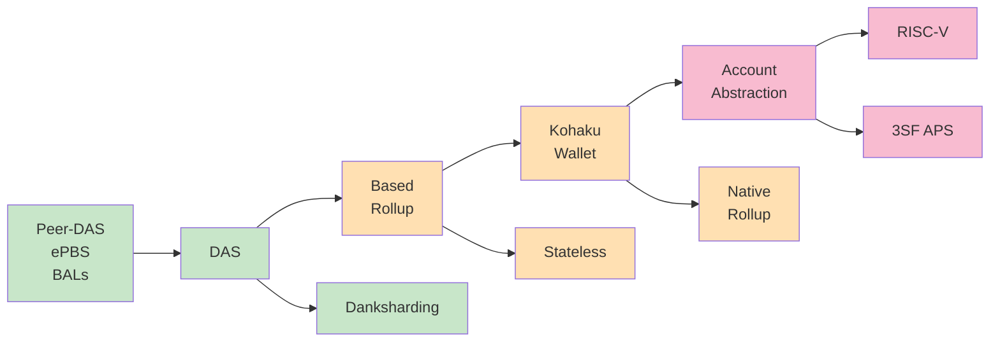

# イーサリアム開発の最前線
### gohan

---
layout: two-cols
layoutClass: gap-16
---

# 自己紹介

::left::

  

    Profile Image
  

  <h3 class="text-xl font-bold">gohan</h3>
  
Nyx Foundation所属

  
ZK Tokyo運営

  
早稲田大学暗号学修士

  
イーサリアム財団奨学生

::right::

  <h4 class="text-lg font-bold mb-4">これまでやったこと</h4>
  
  <ul class="text-sm space-y-2 mb-6">
    <li>✓ イーサリアムへ複数バグ報告</li>
    <li>✓ イーサリアムFusaka監査コンテストで15件のバグ報告</li>
    <li>✓ イーサリアムクライアントGeth, Enigonの実装改善に貢献</li>
    <li>✓ zkVMベンチマークの研究（国際学会採択）</li>
    <li>✓ MPCで数理最適化を解くシステムの研究（EFと共同）</li>
  </ul>

  

    

      AWS
    

    

      Ethereum
    

  

---

# 本勉強会の目的

## 3つの地図を完全理解する！！！

  

    
🧭

    <h3 class="font-bold text-center">ロードマップの方向性</h3>
    
シンプル・柔軟性・分散性を保ったまま速く

  

  
  

    
📅

    <h3 class="font-bold text-center">直近アップグレード</h3>
    
Fusaka/Glamsterdam

  

  
  

    
🔗

    <h3 class="font-bold text-center">エコシステム</h3>
    
zkHyperliquid Bitcoin DeFi Privacy etc.

  

---

# イーサリアムについておさらい

イーサリアムは信頼機関なしで動くプログラムを実行できる「分散型アプリ基盤」

  

    

      <h4 class="font-bold mb-3 text-sm">誰が正しいか多数決で決める</h4>
      

        

        

        

        →
        
多数決

      

    

    

      <h4 class="font-bold mb-3 text-sm">いつ会計が締められるかが明確</h4>
      

        

          ブロック提案
          検証
          正当化
          確定
        

        

          
          12s
          
          6min
        

      

    

    

      <h4 class="font-bold mb-3 text-sm">L2でスケール、L1で信頼を担保</h4>
      

        複数ノード
        →
        L2
        →
        L1
      

    

  

  

    <h4 class="font-bold mb-3 text-sm">ブロックチェーン構造</h4>
    

      

        
N

        →
        
N

        →
        
N

      

      

        
N

        →
        
N

      

    

  

---

# イーサリアムロードマップ

シンプルに・柔軟に・分散したまま速く

---

# まとめ

  

    <h3 class="font-bold mb-2">🧭 ロードマップ</h3>
    
シンプル・柔軟性・分散性を保ったまま速く

  

  
  

    <h3 class="font-bold mb-2">📅 アップグレード</h3>
    
直近のFusaka/Glamsterdamに注目

  

  
  

    <h3 class="font-bold mb-2">🔗 エコシステム</h3>
    
多様なアプリケーションの発展

  

  <h2 class="text-3xl font-bold">ご質問ありがとうございました</h2>

---
layout: cover
---

# Thank you!