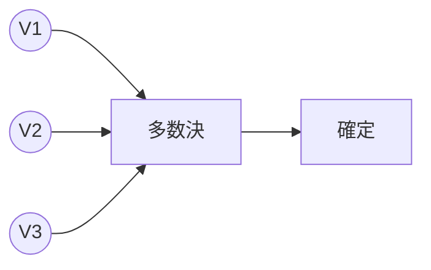
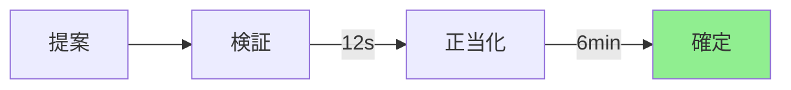
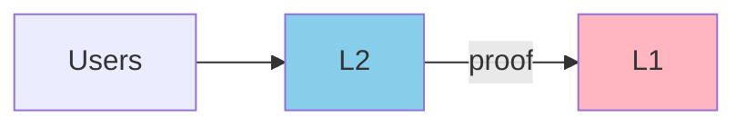
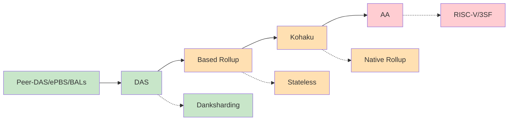
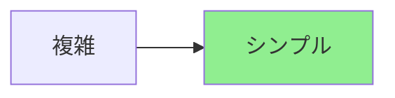
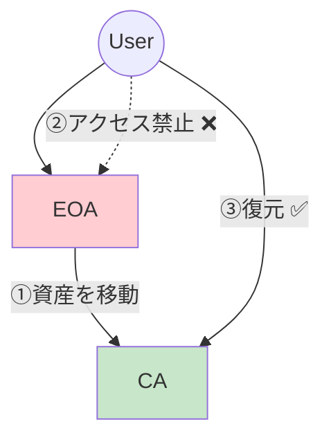
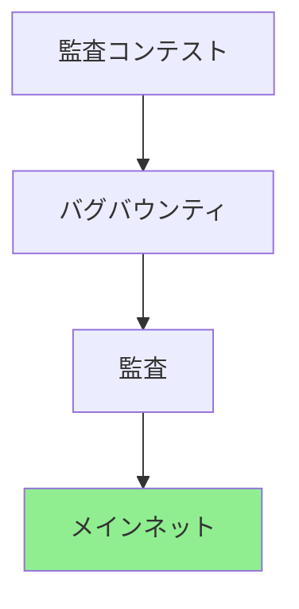
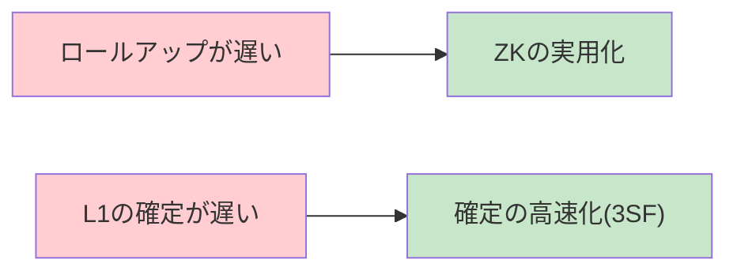
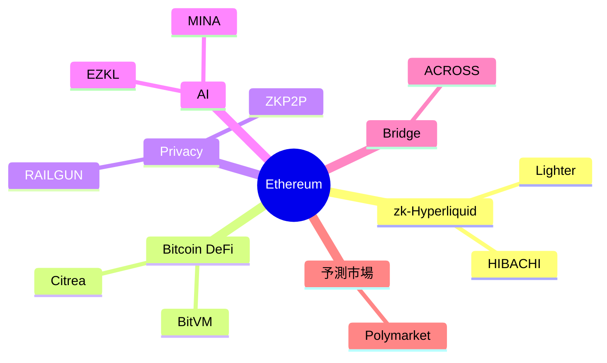

# イーサリアム開発の最前線
## 技術課題・研究動向・将来展望

gohan

---
layout: two-cols
layoutClass: gap-8
---

# 自己紹介

**gohan**

- Nyx Foundation所属
- ZK Tokyo運営
- 早稲田大学暗号学修士
- イーサリアム財団奨学生

::right::

**これまでやったこと**

- イーサリアムへ複数バグ報告
- Fusaka監査コンテストで15件のバグ報告
- Geth, Erigonの実装改善に貢献
- zkVMベンチマークの研究（国際学会採択）
- MPCで数理最適化を解くシステムの研究

---

# 本勉強会の目的

3つの地図を完全理解する！！！

🧭

ロードマップの方向性

シンプル・柔軟性・分散性を保ったまま速く

📅

直近アップグレード

Fusaka / Glamsterdam

🔗

エコシステム

zkHyperliquid / Bitcoin DeFi / Privacy

---

# イーサリアムについておさらい

イーサリアムは信頼機関なしで動くプログラムを実行できる**「分散型アプリ基盤」**

**ポイント**
- 誰が正しいか多数決で決める
- いつ会計が締められるかが明確
- L2でスケール、L1で信頼を担保

---

# イーサリアムロードマップ

シンプルに・柔軟に・分散したまま速く

---

# ①シンプルに

RISC-V

Solidity → Rust, Go（高速化&拡張性）

leanConsensus (zkVM統合)

固有アルゴリズム → ZK検証

Account Abstraction (EOA廃止)

EOA & CA → CA only

Stateless

フルノード → 軽量ノード

---

# ウォレット耐量子移行のカギはAccount Abstraction

イーサリアムがビットコインを救う？？？

zkVMを用いたビットコインの耐量子移行実現に取り組むエンジニアも

---

# ②柔軟に

| レイヤー | 技術 | 効果 |
|---|---|---|
| **L1** | ePBS | ビルダーとの通信が柔軟に |
| **L1** | leanConsensus | コンセンサスが柔軟に |
| **L2** | Based Rollup | ロールアップが柔軟に |
| **L2** | Native Rollup | シーケンサーロジックの強制化 |
| **User** | Kohaku Wallet | ウォレットが柔軟に |

---

# ③分散性を保ったまま速く

Block Latency

12s → 4s

- **Block-level Access Lists**: 並列処理
- **Data Availability Sampling**: Blob数増加

Finality

6min → 12s

- **3 Slot Finality (3SF)**

$T_{finality} = 3 \times 4s = 12s$

---

# 直近のアップグレード

| | 主要技術 | ユーザー影響 | ノード運用者影響 |
|---|---|---|---|
| **Fusaka** | PeerDAS | L2 TPS↑ | 負荷↑ |
| **Glamsterdam** | ePBS/BALs/FOCIL | L1 TPS↑ 検閲耐性↑ | 帯域要求↑ 収益安定↑ |

参考: https://eips.ethereum.org/EIPS/eip-7607, https://eips.ethereum.org/EIPS/eip-7773

---

# 安全性を支える仕組み① 形式検証

形式検証とは？

プログラムの安全性を**数学的に証明**する技術

$\forall x: P(x) \Rightarrow Q(f(x))$

テストよりも網羅的に安全性を保障できる

Nyx Foundationの貢献

耐量子署名の一部を形式検証してケンブリッジ大学で開かれたEF合宿で発表

AIエージェントでLean形式検証を自動化

---

# 安全性を支える仕組み② 実装セキュリティ対策

**実装ガード**: 後方互換性、フェイルセーフ機構

**クライアント多様性**: 複数言語実装、単一障害点排除

10年間 ゼロダウンタイム

バグバウンティ: 2件 / 監査コンテスト: 15件

---

# よくある疑問: なぜL2ではなくL1？

Tempo / Hyperliquid / Arc などがL1を選択

参考: Ethproofs, 3SF論文

---

# イーサリアムユースケース

---
layout: two-cols
layoutClass: gap-8
---

# Nyx Foundationの実践経験

- マイナンバーカードを使ったDID
- zkVM
- 無担保DeFiローン
- MPCを使った決済ネッティング
- DeFiソルバーアルゴリズム
- クロスチェーンブリッジ
- NFT / ステーブルコイン
- ノード運用
- +複数件のセキュリティ監査

::right::

お気軽にご相談ください

contact@nyx.foundation

---

# イーサリアム財団の動向

- **dAI Team**: AI関連の研究開発
- **ESP Grants**: 助成金プログラム刷新
- **Institutional Liquidity Layer**: 機関投資家向け
- **Ethereum Treasuries**: 企業のETH保有増加

チャンス！

---

# イーサリアム上での資産運用

プロ参入で戦略も高度化

- **DEX**: JIT流動性の活用
- **Lending**: キュレーター型ポートフォリオ管理

収益機会の変化

- **BuilderNet**: ブロック構築の分散化
- **Prover Network**: ZK証明生成への参加

---

# イーサリアム・クライアント実装の違い（EL）

| | 言語 | ディスク | 特徴 |
|---|---|---|---|
| **Geth** | Go | 1.2TB | ロードマップ実装最速、API充実 |
| **Erigon** | Go | 1TB | 軽量、高速同期、CL不要 |
| **Nethermind** | .NET | 1.1TB | MEV/Flashbots標準搭載 |
| **Besu** | Java | 1.4TB | エンタープライズ特化 |
| **Reth** | Rust | 1.6TB | ExEx拡張、高速DB |

---

# イーサリアム・クライアント実装の違い（CL）

| | 言語 | メモリ | 特徴 |
|---|---|---|---|
| **Prysm** | Go | ～5GiB | MEV機能充実 |
| **Lighthouse** | Rust | ～5GiB | 保守性、多段防御 |
| **Nimbus** | Nim | ～3GiB | 低メモリ |
| **Lodestar** | JS | ～8GiB | 拡張性 |
| **Teku** | Java | ～10GiB | Besu相性良 |

---

# どのクライアントを選択すればいいの？

| ユースケース | EL | CL |
|---|---|---|
| RPCノード運用 | Geth | Nimbus |
| バリデータ運用 | Nethermind | Lighthouse / Prysm |
| 独自実装・拡張 | Reth / Erigon | Lodestar |
| 独自チェーン | Besu | Teku |

※十分なインターネット速度下であればパフォーマンス・APYに特に差はない
※RPCノード運用時はWAF設定等でセキュリティを徹底すること

---

# 今日のまとめ

🧭

ロードマップの方向性

シンプル・柔軟性・分散性を保ったまま速く

📅

直近アップグレード

Fusaka / Glamsterdam

🔗

エコシステム

zkHyperLiquid / Bitcoin DeFi / Privacy

---
layout: cover
---

# Thank you!
