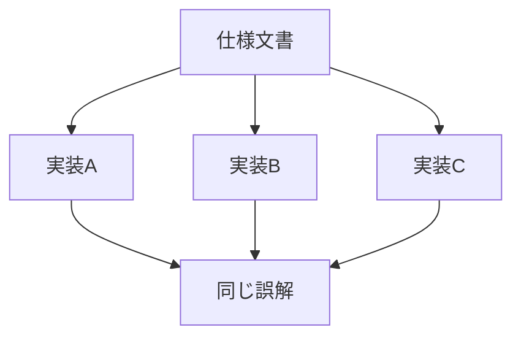

# 多実装環境で起こる問題

多実装環境・Nバージョンプログラミング

> 「独立実装でも共通障害は偶然より有意に多く発生する」

— Knight & Leveson (1986)

Nバージョンプログラミングの仮定 
「独立開発なら障害も独立」は**成立しない**

**形式検証**で自動検知は可能だが 
コスト・時間の観点で採用が難しい

Knight & Leveson, IEEE TSE, 1986, https://doi.org/10.1109/TSE.1986.6312924

<!--
では、その複雑な問題とは何でしょうか。

この図のように、同じ仕様文書を複数のチームが独立に実装する環境があります。これは「多実装環境」や「Nバージョンプログラミング」と呼ばれ、言語やプラットフォームの多様性確保、相互運用性の向上などを目的として採用されます。前のページで示したHTTP/1.1も、様々なライブラリやブラウザが独立に実装している例です。

しかし、1986年のKnightとLevesonの有名な研究で、興味深い結果が示されました。独立に開発された実装であっても、仕様の曖昧な部分について同じ誤解をする「共通モード障害」が偶然より高い頻度で発生するのです。

つまり、Nバージョンプログラミングの前提である「独立開発なら障害も独立」は成立しないことが実証されています。

では、このような共通モード障害を自動的に検知することはできるのでしょうか？形式検証などの手法はありますが、コストや時間の観点から採用が難しいのが現状です。
-->
