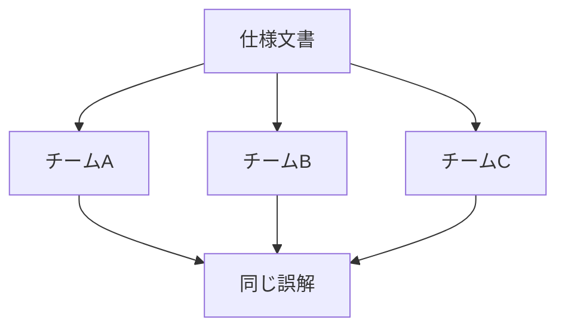

# 多実装環境では「全員が同じ誤解をする」問題が発生する

> 「独立実装でも共通障害は偶然より有意に多く発生する」

— Knight & Leveson (1986)

Nバージョンプログラミングの仮定 
「独立開発なら障害も独立」は**成立しない**

[4] Knight & Leveson, IEEE TSE, 1986

<!--
多実装環境、つまり同じ仕様を複数のチームが独立に実装する環境では、興味深い問題が生じます。

1986年のKnightとLevesonの有名な研究で示されたように、独立に開発された実装であっても、仕様の曖昧な部分について同じ誤解をする「共通モード障害」が偶然より高い頻度で発生します。

これは、仕様文書の曖昧さや、暗黙の前提が原因です。Nバージョンプログラミングでは「独立開発なら障害も独立」と仮定しますが、実際にはそうならないことが実証されています。
-->
