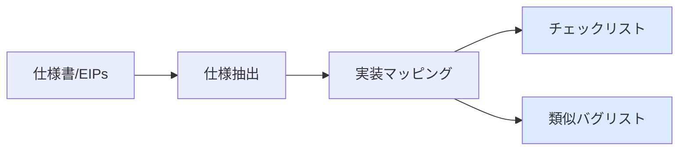
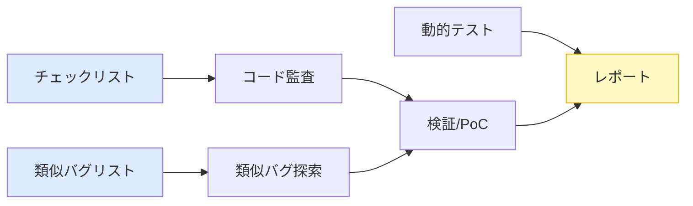

# 提案手法: AI監査エージェント

### Phase 1: 準備

 

### Phase 2: 監査

<!--
提案するAI監査エージェントの概要です。

Phase 1の準備フェーズでは、仕様書から要件を抽出し、実装マッピングを行って、チェックリストと類似バグリストを作成します。

Phase 2の監査フェーズでは、3つの戦略を並行実行します。
コード監査と類似バグ探索は検証・PoC作成を経て、動的テストは直接、最終レポートに統合されます。
-->
