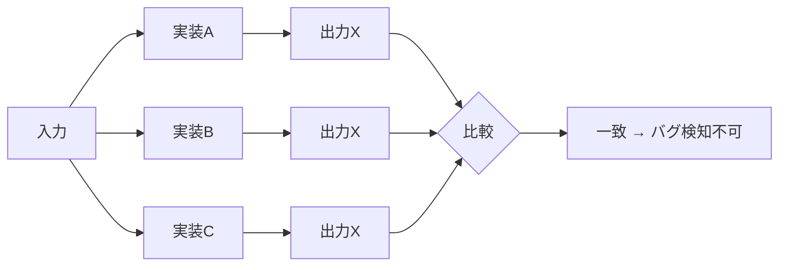

# 差分テストは「全実装が同じ誤りをする」と検知できない

### 差分テスト/ファジングの限界

- Fluffy (2021)、LOKI (2023) 等
- 複数実装の**出力差分**でバグ検知
- 全員が同じ誤解 → 差分なし

**意味的盲点 (Semantic Blind Spot)**

オラクルが「他実装との違い」であり「仕様との整合性」ではない

Yang et al., Fluffy, OSDI 2021, https://www.usenix.org/conference/osdi21/presentation/yang 
Ma et al., LOKI, NDSS 2023, https://www.ndss-symposium.org/ndss-paper/loki-state-aware-fuzzing-framework-for-the-implementation-of-blockchain-consensus-protocols/ 
Kim et al., FORKY, ICSE 2025, https://doi.org/10.1109/ICSE55347.2025.00085

<!--
既存の自動化手法として、差分テストや差分ファジングがあります。FluffyやLOKIといった手法は、複数の実装に同じ入力を与え、出力の「差分」を検知することでバグを発見します。

これは非常に強力な手法ですが、構造的な限界があります。それは、先ほど説明した共通モード障害、つまりすべての実装が同じ誤解をしている場合、差分が出ないためバグを検知できないという点です。

我々はこれを「意味的盲点」と呼んでいます。差分テストのオラクル、つまり正解の判定基準は「他の実装との違い」であり、「仕様との整合性」ではないのです。
-->
