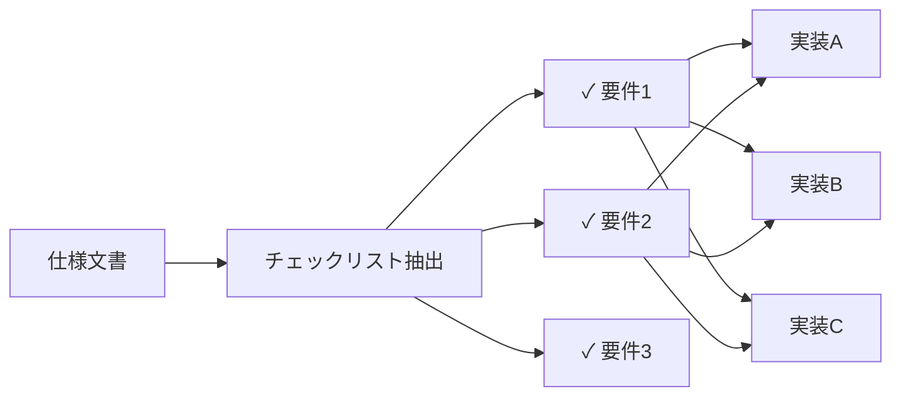

# 仕様チェックリストは差分に依存しない監査の根拠となる

**差分ではなく仕様を根拠に**

各実装を独立に仕様と照合

**1つの発見 → 多実装へ横展開**

同じチェックリストを全実装に適用

<!--
本研究の核心的なアイデアは、仕様からチェックリストを抽出し、それを各実装に独立に適用することです。

これにより、実装間の差分ではなく、仕様そのものを正しさの根拠とできます。

さらに重要なのは、ある実装で発見したバグパターンを、同じチェックリストを用いて他の実装にも横展開できる点です。これにより、1つの発見を多実装環境全体に効率的にスケールできます。

我々はこれを「仕様チェックリスト駆動監査」と呼んでいます。
-->
