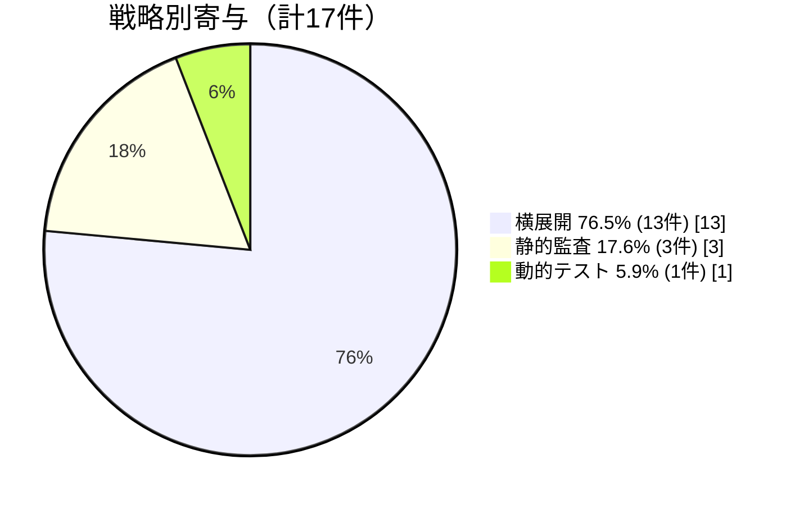

# 横展開チェックが有効発見の76.5%を占めた

**1 → N スケール**が有効

1つの発見を多実装に横展開することで、効率的に脆弱性を発見

仕様の曖昧な部分で複数チームが同じ誤解 → 横展開戦略の有効性を実証

<!--
戦略別の寄与分析の結果、横展開チェック、つまり1つの発見を他の実装に展開する戦略が有効発見の76.5%、17件中13件を占めました。

これは、多実装環境において、横展開戦略が極めて有効であることを示しています。仕様の曖昧な部分で複数チームが同じ誤解をしているという仮説と整合する結果です。

仕様ベースの静的監査は3件、動的テストは1件のみで、5.9%にとどまりました。動的テストが少なかったのは、テスト環境の構築コストが高く、また差分テストと同様に意味的盲点の影響を受けるためです。
-->
