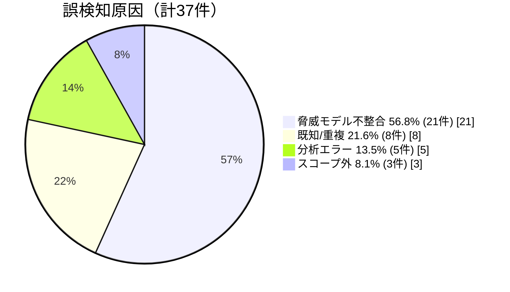

# 誤検知の最大原因はLLM能力ではなく脅威モデル不整合である

**脅威モデル不整合の例**

- 我々：「実行層を信頼しない」
- コンテスト：「実行層は信頼コンポーネント」

前提条件のズレが誤検知の過半数を占める

誤検知の過半数は**前提条件の不整合**に起因 → 工程として前提を明示化すれば改善可能

<!--
37件の誤検知を分析した結果、最大の原因は「脅威モデル不整合」で56.8%を占めました。

脅威モデルとは、「誰が攻撃者になりうるか」「どこまでを信頼するか」という前提条件のことです。

具体的には、我々のプロンプトでは実行層を「信頼しない」と設定していましたが、コンテストのルールでは「信頼コンポーネント」として扱われていました。この前提条件のズレが21件の誤検知を生みました。

重要な洞察は、誤検知の過半数が大規模言語モデルの推論能力の問題ではなく、前提条件の不整合に起因しているという点です。これは、工程として前提を明示化することで改善可能です。
-->
