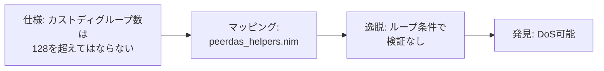

# 発見事例: Nimbus カストディローテーション

<div class="mt-4">



</div>

<div class="grid grid-cols-2 gap-6 mt-4">

<div>

### 仕様要件

```
custody_group_count MUST NOT
exceed NUMBER_OF_CUSTODY_GROUPS
(= 128)
```

</div>

<div>

### 問題のコード

```nim
while custody_groups.len <
      custody_group_count:
  # 上限チェックなし
  ...
```

</div>

</div>

<div class="mt-4 p-3 bg-green-50 border-l-4 border-green-500">

**結果**: 低重大度として認定 — 悪意あるピアが過大な値を送ることでサービス拒否攻撃が可能

</div>

<!--
これは我々が発見した低重大度の脆弱性の具体例です。

仕様から「カストディグループ数は128を超えてはならない」という要件を抽出しました。カストディグループとは、データ可用性サンプリングという技術で各ノードが担当するデータの集まりのことです。

Nimbusの該当コードにマッピングした結果、この上限チェックがループ条件で行われておらず、悪意あるピアが過大な値を送ることでサービス拒否攻撃が可能でした。

これは仕様駆動監査の成功例です。ただし、我々の発見はLowのみで、HighやMediumの脆弱性は発見できませんでした。次に、誤検知の分析を見てみましょう。
-->
