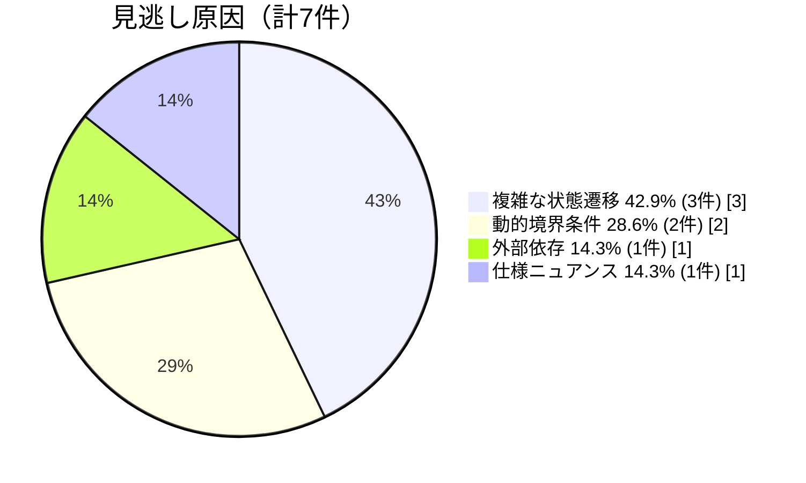

# 見逃しの最大原因は複雑な状態遷移と動的境界条件

高重大度 0/5、中重大度 0/2

→ 重大な脆弱性は全て見逃し

| 見逃し原因 | 例 |
|------------|-----|
| 複雑な状態遷移 | フォーク境界での長い状態変化 |
| 動的境界条件 | 実行時に決まるガード条件 |

チェックリスト充実で改善可能

<!--
V1では、高重大度5件、中重大度2件、計7件の重大な脆弱性をすべて見逃しました。

見逃しの原因を分析すると、42.9%が「複雑な状態遷移」、28.6%が「動的境界条件」でした。

複雑な状態遷移とは、例えばフォーク境界での長い状態変化のように、複数のステップにまたがる状態変化のことです。動的境界条件とは、実行時に決まるガード条件のことです。

重要なのは、これらは本手法の根本的な限界ではなく、チェックリストを充実させることで改善可能な課題であるという点です。
-->
