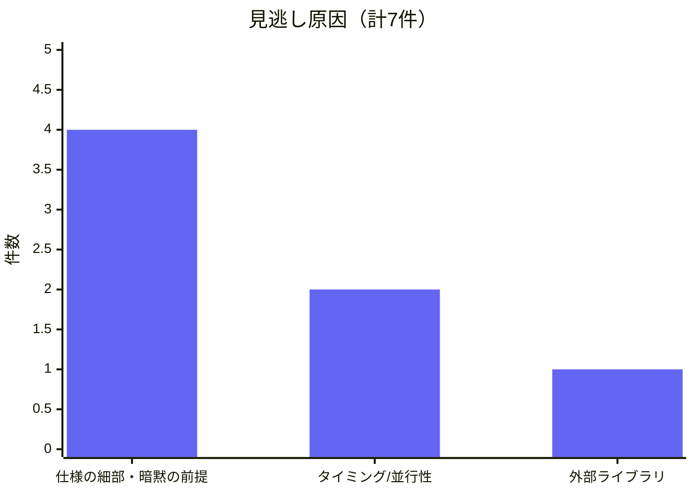

# 見逃しの原因分析

高重大度 0/5、中重大度 0/2

→ 重大な脆弱性は全て見逃し

| 見逃し原因 | 例 |
|------------|-----|
| 仕様の細部・暗黙の前提 | キャッシュキー設計、長さ検証 |
| タイミング/並行性 | Fork遷移、metadata更新間隔 |
| 外部ライブラリ | 暗号ライブラリ（スコープ外） |

チェックリストの粒度向上とスコープ拡大で改善可能

<!--
見逃し原因をグラフで整理しました。高重大度5件、中重大度2件、計7件の重大な脆弱性を全て見逃しています。

最も多いのが「仕様の細部・暗黙の前提」で4件。これはチェックリストの粒度を上げることで改善可能です。

「タイミング/並行性」が2件。これは静的分析では捉えにくい動的な問題で、現在の手法の限界です。

「外部ライブラリ」は1件。スコープを拡大することで対応可能です。

重要なのは、大半はチェックリストの粒度向上とスコープ拡大で改善可能という点です。この分析を踏まえて、V2では改善を行いました。
-->
